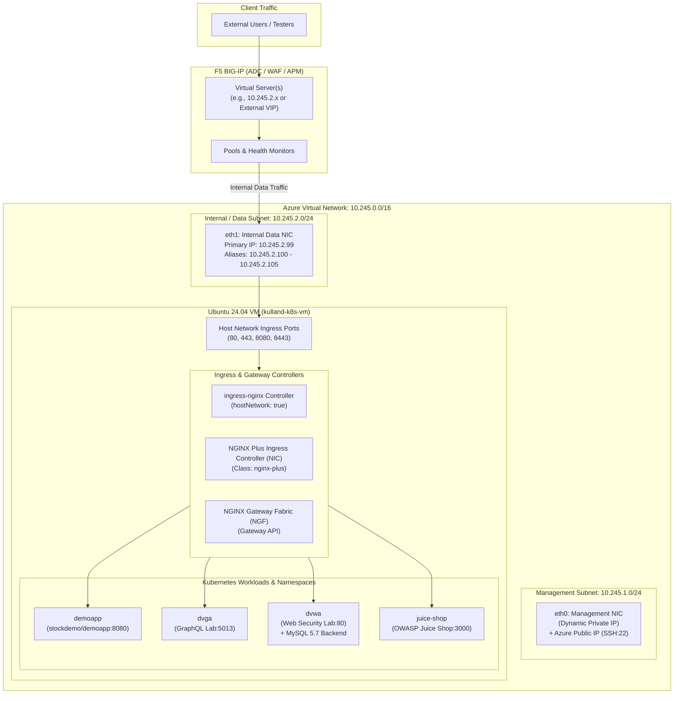

# Azure Ubuntu Kubernetes Lab & F5 BIG-IP Backend Server

This repository provisions an automated, single-node Kubernetes (v1.32) environment running on Ubuntu 24.04 LTS in Microsoft Azure using Terraform. 

It is specifically architected to serve as a **multi-workload internal backend server for F5 BIG-IP** (VE or hardware) to direct traffic to for load balancing, WAF/ASM security inspection, API protection, and two-tier ADC integration.

---

## Logical Architecture Map

The following diagram illustrates the network segmentation, dual-NIC VM architecture, and internal Kubernetes workloads configured to receive traffic from an upstream F5 BIG-IP.



---

## Role as an Internal Server for F5 BIG-IP

### 1. Dedicated Multi-IP Pool Members (`10.245.2.100` – `10.245.2.105`)
The internal network interface (`azurerm_network_interface.internal_nic`) is configured with a primary IP (`10.245.2.99`) and **6 sequential secondary static IP addresses**:

| IP Address | Interface | Recommended BIG-IP Role | Target Workload |
| :--- | :--- | :--- | :--- |
| `10.245.2.99` | Primary NIC IP | General Gateway / Ingress Endpoint | Default Ingress Controller |
| `10.245.2.100` | Secondary Alias 1 | Pool Member: DemoApp | `demoapp.lab.internal` (Port 80) |
| `10.245.2.101` | Secondary Alias 2 | Pool Member: DVGA (GraphQL) | `dvga.lab.internal` (Port 80) |
| `10.245.2.102` | Secondary Alias 3 | Pool Member: DVWA (Web App) | `dvwa.lab.internal` (Port 80) |
| `10.245.2.103` | Secondary Alias 4 | Pool Member: OWASP Juice Shop | `juice-shop.lab.internal` (Port 80) |
| `10.245.2.104` | Secondary Alias 5 | Pool Member: NGINX Plus IC | Ingress Class `nginx-plus` |
| `10.245.2.105` | Secondary Alias 6 | Pool Member: NGINX Gateway Fabric | Gateway API listeners |

This multi-IP assignment enables BIG-IP administrators to:
- Configure **1:1 Node definitions** in BIG-IP without requiring complex port translations.
- Route different BIG-IP Virtual Servers to dedicated backend IP addresses on the same VM.
- Test routing policies, SNAT pools, and route domains.

---

### 2. Primary BIG-IP Use Cases

#### A. F5 BIG-IP Advanced WAF / ASM Testing
The included workloads represent the industry standards for application security validation:
- **OWASP Juice Shop** (`juice-shop`): Test modern Single Page App (SPA) security, OWASP Top 10 vulnerabilities, API security, and parameter tampering.
- **Damn Vulnerable Web Application** (`dvwa`): Test SQL Injection (backed by a real MySQL database), Cross-Site Scripting (XSS), Command Injection, and Brute Force defense.
- **Damn Vulnerable GraphQL Application** (`dvga`): Test F5 BIG-IP GraphQL profile inspection, query depth limiting, introspection blocking, and batching attack mitigation.

#### B. Two-Tier ADC Architecture (F5 BIG-IP + NGINX)
Simulate enterprise two-tier application delivery architectures:
- **Tier 1 (F5 BIG-IP)**: Perimeter security, DDoS mitigation, SSL offload/re-encryption, global traffic steering, and high-capacity firewalling.
- **Tier 2 (NGINX Plus Ingress / Gateway Fabric)**: Dynamic cluster ingress, fine-grained path-based routing, JWT validation, and per-service microsegmentation.

#### C. Health Monitoring & Traffic Steering
- Test standard HTTP monitors (`GET /` or custom URI health checks).
- Simulate node draining, maintenance modes, and priority group activation.

---

## Example BIG-IP Configuration (TMSH)

To integrate this backend with your BIG-IP, execute the following commands in the BIG-IP TMSH console:

```bash
# 1. Define the Nodes in the internal subnet
create ltm node node_k8s_juice_shop address 10.245.2.103
create ltm node node_k8s_dvwa address 10.245.2.102
create ltm node node_k8s_dvga address 10.245.2.101
create ltm node node_k8s_demoapp address 10.245.2.100

# 2. Create Pools with HTTP Health Checks
create ltm pool pool_juice_shop monitor http members add { node_k8s_juice_shop:80 }
create ltm pool pool_dvwa monitor http members add { node_k8s_dvwa:80 }
create ltm pool pool_dvga monitor http members add { node_k8s_dvga:80 }
create ltm pool pool_demoapp monitor http members add { node_k8s_demoapp:80 }

# 3. Create a Virtual Server with an ASM/WAF Policy attached
create ltm virtual vs_juice_shop_http { \
    destination 10.245.2.50:80 \
    ip-protocol tcp \
    mask 255.255.255.255 \
    pool pool_juice_shop \
    profiles add { http tcp } \
    source-address-translation { type automap } \
}
```

---

## Deployed Applications Directory

All applications are consolidated into multi-document manifests under `manifests/` and managed through Kustomize:

| Application | Namespace | Internal Container Port | ClusterIP Service Port | Ingress Host Header |
| :--- | :--- | :--- | :--- | :--- |
| **DemoApp** | `demoapp` | `8080/TCP` | `80/TCP` | `demoapp.lab.internal` |
| **DVGA** | `dvga` | `5013/TCP` | `80/TCP` | `dvga.lab.internal` |
| **DVWA** | `dvwa` | `80/TCP` | `80/TCP` | `dvwa.lab.internal` |
| **MySQL (DVWA)** | `dvwa` | `3306/TCP` | `3306/TCP` | *(Internal to DVWA)* |
| **Juice Shop** | `juice-shop` | `3000/TCP` | `80/TCP` | `juice-shop.lab.internal` |

---

## Repository Structure

```
k8s_ubuntu/
├── README.md                      # Comprehensive architecture and operations guide
├── main.tf                        # Azure Resource Group & storage account configuration
├── network.tf                     # VNet, Subnets, NSGs, and dual-NIC with dynamic static IP blocks
├── ubuntu-vm.tf                   # Ubuntu 24.04 LTS VM resource definition
├── jwt-validation.tf              # Gates deployment on valid, non-expired F5 NGINX JWT subscription
├── providers.tf                   # Terraform version constraint (>=1.4.0) & AzureRM provider
├── variables.tf                   # Input variable definitions (with sensitive flags)
├── outputs.tf                     # Public IP, SSH connection string, and Azure Portal links
├── terraform.tfvars               # Deployment-specific parameters and network CIDRs
├── manifests/                     # Consolidated Kubernetes manifests
│   ├── kustomization.yaml         # Kustomize entrypoint for one-shot deployment
│   ├── demoapp.yaml               # Demo application manifests (NS, Deploy, Svc, Ingress, HPA)
│   ├── dvga.yaml                  # Damn Vulnerable GraphQL App manifests
│   ├── dvwa.yaml                  # DVWA and MySQL backend manifests
│   └── juice-shop.yaml            # OWASP Juice Shop manifests
├── scripts/
│   ├── k8s.tpl                    # Cloud-init template (Containerd, K8s v1.32, Helm, Flannel)
│   └── post-provision.sh          # Post-provisioning orchestrator (Ingress, Helm, Manifest apply)
└── secrets/
    ├── .gitignore                 # Prevents committing sensitive certificates/keys
    ├── nginx-repo.jwt             # NGINX Plus JWT license and private registry credential
    ├── nginx-repo.crt             # NGINX Plus client certificate
    └── nginx-repo.key             # NGINX Plus client key
```

---

## Deployment Instructions

### 1. Prerequisites
- **Terraform** 1.4.0 or newer.
- **Azure CLI** authenticated with appropriate permissions (`az login`).
- Valid **SSH Public Key** at `~/.ssh/id_rsa.pub` (and private key at `~/.ssh/id_rsa`).
- Valid **F5 NGINX Plus Subscription JWT** saved at `secrets/nginx-repo.jwt`.

### 2. Configure Variables
Inspect and customize `terraform.tfvars`:
- `resource_group_location`: Desired Azure region (e.g., `westus2`).
- `adminSrcAddr`: List of public IPs permitted to access SSH and web ports through the NSG.
- `username` / `password`: Local administrator credentials for the VM.

### 3. Deploy
```bash
# Initialize Terraform providers
terraform init

# Review execution plan (JWT validation runs automatically during this phase)
terraform plan

# Apply infrastructure and trigger in-VM provisioning
terraform apply
```

### 4. What Happens During Provisioning
1. **JWT Validation Gate**: Terraform decodes `secrets/nginx-repo.jwt`, parses the `f5_sat` claim, and aborts immediately if the license is expired.
2. **Infrastructure Creation**: VNet, Subnets, Public IPs, Network Security Groups, NICs, and the Ubuntu VM are created.
3. **Cloud-Init (`scripts/k8s.tpl`)**:
   - Configures kernel modules (`overlay`, `br_netfilter`) and sysctl network forwarding.
   - Installs and tunes `containerd` with `SystemdCgroup = true`.
   - Installs Kubernetes v1.32 (`kubelet`, `kubeadm`, `kubectl`).
   - Initializes control plane (`kubeadm init --pod-network-cidr=10.244.0.0/16`).
   - Installs Flannel CNI, Metrics Server (for HPA), and Helm v3.
   - Untaints the control-plane node so workloads run on this single-node instance.
4. **Post-Provisioning (`scripts/post-provision.sh`)**:
   - Deploys community `ingress-nginx` on `hostNetwork: true`.
   - Applies all application manifests using `kubectl apply -k /home/<user>/manifests`.
   - Creates docker-registry and license secrets from `secrets/nginx-repo.jwt`.
   - Deploys **NGINX Ingress Controller (NIC)** and **NGINX Gateway Fabric (NGF)** using official OCI Helm charts.

---

## Operations & Verification

### Connect to the VM
Use the SSH command emitted in the Terraform output:
```bash
ssh -i ~/.ssh/id_rsa <username>@<Management_Public_IP>
```

### Verify Cluster & Applications
```bash
# Check node status
kubectl get nodes -o wide

# Check all deployed pods
kubectl get pods -A

# Check application ingress resources
kubectl get ingress -A

# Test internal application routing via HTTP Host header
curl -H "Host: demoapp.lab.internal" http://localhost/
curl -H "Host: juice-shop.lab.internal" http://localhost/
curl -H "Host: dvga.lab.internal" http://localhost/
curl -H "Host: dvwa.lab.internal" http://localhost/
```

### Teardown
To destroy all Azure resources created by this configuration:
```bash
terraform destroy
```
