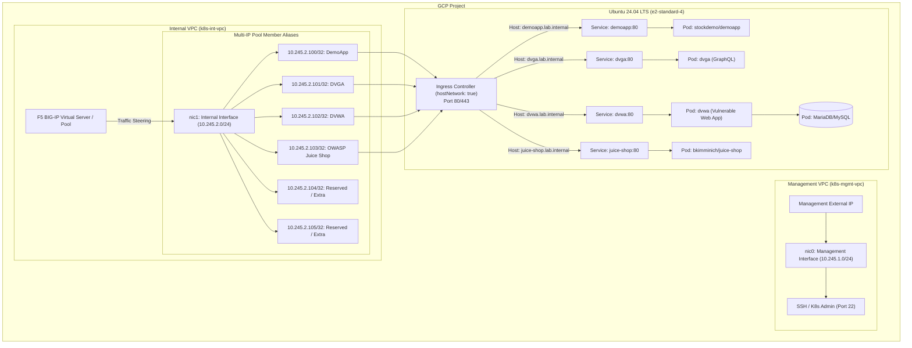

# GCP Ubuntu Kubernetes Lab & F5 BIG-IP Backend Server

This repository contains a production-grade Terraform deployment of an **Ubuntu 24.04 LTS** single-node Kubernetes cluster on **Google Cloud Platform (GCP)**. It is architected specifically to emulate a multi-tenant backend server for testing and validating **F5 BIG-IP LTM / ASM / APM / Advanced WAF** architectures.

The single VM is configured with **dual network interfaces (NICs)** across separate VPC networks (`k8s-mgmt-vpc` and `k8s-int-vpc`). The internal interface (`nic1`) is provisioned with a primary IP (`10.245.2.99`) and **six Alias IP ranges (`10.245.2.100/32` through `10.245.2.105/32`)**, allowing BIG-IP to target multiple distinct backend pool members hosted on a single Compute Engine instance.

---

## Architectural Diagram



---

## Network Architecture & IP Allocation

In GCP, multi-NIC instances require each network interface to attach to a **separate VPC network**:
1. **Management VPC (`k8s-mgmt-vpc`)**: Subnet `10.245.1.0/24` with external IP for SSH administration, cloud-init diagnostics, and Kubernetes cluster management.
2. **Internal VPC (`k8s-int-vpc`)**: Subnet `10.245.2.0/24` dedicated to application and proxy data-plane traffic from an external or adjacent F5 BIG-IP device.

### Interface & IP Address Breakdown

| Interface | Subnet | Role | IP Allocation | Description |
| :--- | :--- | :--- | :--- | :--- |
| **`nic0`** | `10.245.1.0/24` | Management | Dynamic Private IP + External IP | Admin SSH access and internet egress |
| **`nic1`** | `10.245.2.0/24` | Internal (Primary) | `10.245.2.99` (Static) | Primary interface IP |
| **`nic1`** | `10.245.2.0/24` | Internal (Alias) | `10.245.2.100/32` | Dedicated Pool Member for **DemoApp** |
| **`nic1`** | `10.245.2.0/24` | Internal (Alias) | `10.245.2.101/32` | Dedicated Pool Member for **DVGA** (Damn Vulnerable GraphQL App) |
| **`nic1`** | `10.245.2.0/24` | Internal (Alias) | `10.245.2.102/32` | Dedicated Pool Member for **DVWA** (Damn Vulnerable Web App) |
| **`nic1`** | `10.245.2.0/24` | Internal (Alias) | `10.245.2.103/32` | Dedicated Pool Member for **OWASP Juice Shop** |
| **`nic1`** | `10.245.2.0/24` | Internal (Alias) | `10.245.2.104/32` | Reserved for custom workloads / secondary ingress |
| **`nic1`** | `10.245.2.0/24` | Internal (Alias) | `10.245.2.105/32` | Reserved for custom workloads / secondary ingress |

---

## Why This Architecture for F5 BIG-IP Labs?

### 1. Multi-IP Server Emulation
In an enterprise lab or customer proof-of-concept (PoC), deploying separate physical or virtual machines for every backend application consumes excessive compute resources and complicates infrastructure management. By attaching secondary Alias IP ranges to a single Compute Engine instance, the BIG-IP can treat each IP as an independent node and pool member.

### 2. Advanced WAF (ASM) Testing Matrix
Each preloaded application targets different security domains:
- **OWASP Juice Shop**: Modern Single Page App (Angular/NodeJS) ideal for API security, JSON validation, and XSS/CSRF testing.
- **DVWA (Damn Vulnerable Web App)**: Classic PHP/MySQL application perfect for SQL Injection, Command Injection, and Path Traversal testing.
- **DVGA (Damn Vulnerable GraphQL Application)**: Purpose-built for testing GraphQL introspection, batching attacks, and query depth/complexity limits.
- **DemoApp**: Lightweight HTTP application designed for baseline load balancing and synthetic health monitors.

### 3. Traffic Steering & Health Monitoring
- Test standard HTTP monitors (`GET /` or custom URI health checks).
- Simulate node draining, maintenance modes, and priority group activation.

---

## Example BIG-IP Configuration (TMSH)

To integrate this backend with your BIG-IP, execute the following commands in the BIG-IP TMSH console:

```bash
# 1. Define the Nodes in the internal subnet
create ltm node node_k8s_juice_shop address 10.245.2.103
create ltm node node_k8s_dvwa address 10.245.2.102
create ltm node node_k8s_dvga address 10.245.2.101
create ltm node node_k8s_demoapp address 10.245.2.100

# 2. Create Pools with HTTP Health Checks
create ltm pool pool_juice_shop monitor http members add { node_k8s_juice_shop:80 }
create ltm pool pool_dvwa monitor http members add { node_k8s_dvwa:80 }
create ltm pool pool_dvga monitor http members add { node_k8s_dvga:80 }
create ltm pool pool_demoapp monitor http members add { node_k8s_demoapp:80 }

# 3. Create a Virtual Server with an ASM/WAF Policy attached
create ltm virtual vs_juice_shop_http { \
    destination 10.245.2.50:80 \
    ip-protocol tcp \
    mask 255.255.255.255 \
    pool pool_juice_shop \
    profiles add { http tcp } \
    source-address-translation { type automap } \
}
```

---

## Deployed Applications Directory

All applications are consolidated into multi-document manifests under `manifests/` and managed through Kustomize:

| Application | Namespace | Internal Container Port | ClusterIP Service Port | Ingress Host Header |
| :--- | :--- | :--- | :--- | :--- |
| **DemoApp** | `demoapp` | `8080/TCP` | `80/TCP` | `demoapp.lab.internal` |
| **DVGA** | `dvga` | `5013/TCP` | `80/TCP` | `dvga.lab.internal` |
| **DVWA** | `dvwa` | `80/TCP` | `80/TCP` | `dvwa.lab.internal` |
| **MySQL (DVWA)** | `dvwa` | `3306/TCP` | `3306/TCP` | *(Internal to DVWA)* |
| **Juice Shop** | `juice-shop` | `3000/TCP` | `80/TCP` | `juice-shop.lab.internal` |

---

## Repository Structure

```
k8s_ubuntu/
├── README.md                      # Comprehensive architecture and operations guide
├── Taskfile.yml                   # Task runner commands (init, validate, plan, apply, deploy, destroy)
├── main.tf                        # Random ID provider configuration
├── network.tf                     # Management & Internal VPCs, Subnets, Firewalls, External IPs
├── ubuntu-vm.tf                   # Ubuntu 24.04 LTS GCE instance with dual NICs and Alias IPs
├── jwt-validation.tf              # Gates deployment on valid, non-expired F5 NGINX JWT subscription
├── providers.tf                   # Terraform version constraint (>=1.4.0) & Google provider
├── variables.tf                   # Input variable definitions
├── outputs.tf                     # Public IP, SSH connection string, and internal endpoints
├── terraform.tfvars.boilerplate   # Template configuration file
├── manifests/                     # Consolidated Kubernetes manifests
│   ├── kustomization.yaml         # Kustomize entrypoint for one-shot deployment
│   ├── demoapp.yaml               # Demo application manifests (NS, Deploy, Svc, Ingress, HPA)
│   ├── dvga.yaml                  # Damn Vulnerable GraphQL App manifests
│   ├── dvwa.yaml                  # DVWA and MySQL backend manifests
│   └── juice-shop.yaml            # OWASP Juice Shop manifests
├── scripts/
│   ├── k8s.tpl                    # Cloud-init template (Containerd, K8s v1.32, Helm, Flannel)
│   └── post-provision.sh          # Post-provisioning orchestrator (Ingress, Helm, Manifest apply)
└── secrets/
    ├── .gitignore                 # Prevents committing sensitive certificates/keys
    ├── nginx-repo.jwt             # NGINX Plus JWT license and private registry credential
    ├── nginx-repo.crt             # NGINX Plus client certificate
    └── nginx-repo.key             # NGINX Plus client key
```

---

## Deployment Instructions

### 1. Prerequisites
- **Terraform** 1.4.0 or newer.
- **Google Cloud SDK (`gcloud`)** installed and authenticated (`gcloud auth application-default login`).
- Valid **SSH Public Key** at `~/.ssh/id_rsa.pub` (and private key at `~/.ssh/id_rsa`).
- Valid **F5 NGINX Plus Subscription JWT** saved at `secrets/nginx-repo.jwt`.

### 2. Configure Variables
Copy `terraform.tfvars.boilerplate` to `terraform.tfvars` and customize:
- `gcp_project` / `gcp_project_id`: Your GCP project ID.
- `gcp_region` / `gcp_zone`: Desired GCP region and zone (e.g., `us-west1` / `us-west1-a`).
- `adminSrcAddr`: List of public IPs permitted to access SSH and web ports.
- `username`: Local administrator credentials for the VM.

### 3. Deploy
```bash
# Initialize Terraform providers
terraform init

# Review execution plan (JWT validation runs automatically during this phase)
terraform plan

# Apply infrastructure and trigger in-VM provisioning
terraform apply
```

### 4. What Happens During Provisioning
1. **JWT Validation Gate**: Terraform decodes `secrets/nginx-repo.jwt`, parses the `f5_sat` claim, and aborts immediately if the license is expired.
2. **Infrastructure Creation**: Management and Internal VPCs, Subnets, Firewalls, External IPs, and the GCE instance are created.
3. **Cloud-Init (`scripts/k8s.tpl`)**:
   - Configures kernel modules (`overlay`, `br_netfilter`) and sysctl network forwarding.
   - Installs and tunes `containerd` with `SystemdCgroup = true`.
   - Installs Kubernetes v1.32 (`kubelet`, `kubeadm`, `kubectl`).
   - Initializes control plane (`kubeadm init --pod-network-cidr=10.244.0.0/16`).
   - Installs Flannel CNI, Metrics Server (for HPA), and Helm v3.
   - Untaints the control-plane node so workloads run on this single-node instance.
4. **Post-Provisioning (`scripts/post-provision.sh`)**:
   - Deploys community `ingress-nginx` on `hostNetwork: true`.
   - Applies all application manifests using `kubectl apply -k /home/<user>/manifests`.
   - Creates docker-registry and license secrets from `secrets/nginx-repo.jwt`.
   - Deploys **NGINX Ingress Controller (NIC)** and **NGINX Gateway Fabric (NGF)** using official OCI Helm charts.

---

## Operations & Verification

### Connect to the VM
Use the SSH command emitted in the Terraform output:
```bash
ssh -i ~/.ssh/id_rsa <username>@<Management_Public_IP>
```

### Verify Cluster & Applications
```bash
# Check node status
kubectl get nodes -o wide

# Check all deployed pods
kubectl get pods -A

# Check application ingress resources
kubectl get ingress -A

# Test internal application routing via HTTP Host header
curl -H "Host: demoapp.lab.internal" http://localhost/
curl -H "Host: juice-shop.lab.internal" http://localhost/
curl -H "Host: dvga.lab.internal" http://localhost/
curl -H "Host: dvwa.lab.internal" http://localhost/
```

### Teardown
To destroy all GCP resources created by this configuration:
```bash
terraform destroy
```
